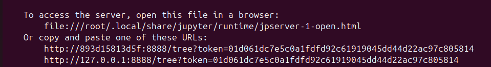

# Python Data Science & Machine Learning Docker Environment
A fully containerized, reproducible environment for Data Science (DS) and Machine Learning (ML) projects, leveraging Python, Docker, and DevOps best practices. This project enables users to quickly launch a Jupyter Notebook server with all essential Python libraries pre-installed, making it easy to start, stop, and resume your DS/ML workflow on any system.

## Features
* **Pre-configured Python environment** with popular DS/ML libraries: pandas, numpy, matplotlib, scikit-learn, and more.
* **Jupyter Notebook** server for interactive development.
* **Dockerized setup** for consistency, portability, and reproducibility.
* **DevOps-friendly**: Rapid deployment, simple container management, and easy integration into CI/CD pipelines.

## Getting Started
### Prerequisites
* [Docker](https://docs.docker.com/get-started/get-docker/) installed on your system
* (Optional) [Git](https://git-scm.com/) for cloning this repository

## Usage
### 1. Clone or download the repository and change to the repo's directory
```
cd Python-Data-Science-Machine-Learning-Docker
```

### 2. Build the Docker Image
```
docker build -t py-ds-ml-docker .
```

### 3. Run a Container
```
docker run --name py-ds-ml-docker-container -p 8888:8888 -v $(pwd)/notebooks:/app/notebooks py-ds-ml-docker
```
* This will start the Jupyter Notebook server.
* A URL will be provided for you to copy and paste in your browser. In the image below, it's http://127.0.0.1:8888/tree?token=01d061dc7e5c0a1fdfd92c61919045dd44d22ac97c805814



* The `notebooks` directory on your host is mapped to `/app/notebooks` in the container for persistent storage.

### 4. Stop the Container
`ctrl + c` will stop the container. Alternatively, you can open a new terminal and type `docker container stop py-ds-ml-docker-container`.

### 5. Start the Container Again
```
docker container start --attach py-ds-ml-docker-container
```

## Customization
* Edit `requirements.txt` to add or change Python libraries.
* Modify the `Dockerfile` to customize the environment further.
* Add your own notebooks to the `notebooks` directory.

## Why Docker?
Using Docker ensures your Python DS/ML environment is consistent across all platforms, eliminating "works on my machine" issues.
